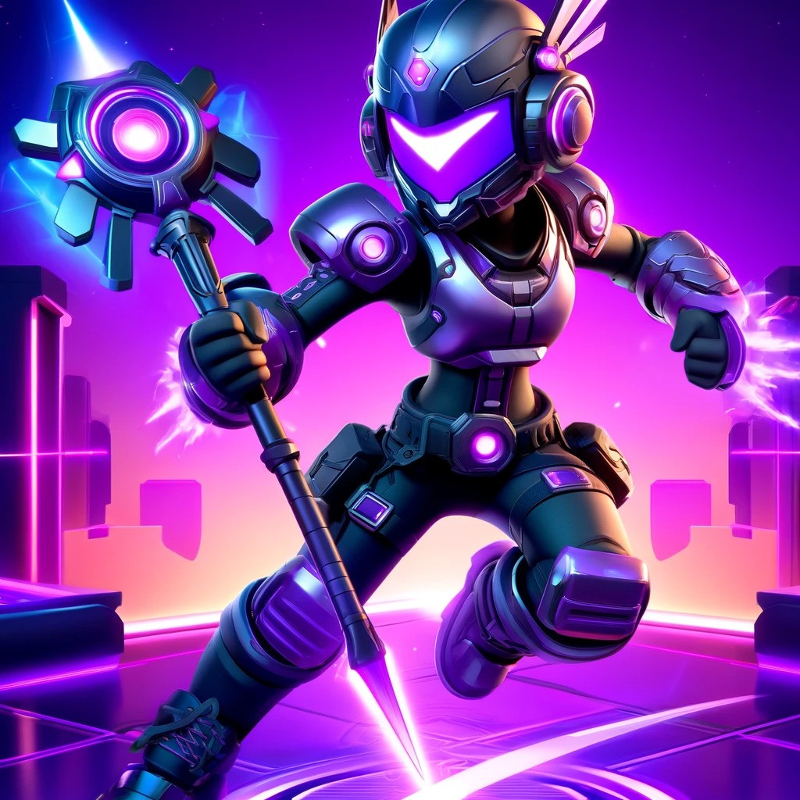

# Pristina: Brawl Stars Discord Bot

## Overview
Pristina is a Discord bot designed specifically for Brawl Stars players, enabling users to predict the outcome of 1v1 matchups based on comprehensive player statistics. Developed to enhance the gaming experience, Pristina uses a logistic regression model trained on historical game data to provide real-time predictive analytics directly within your Discord server.

## Features
- **1v1 Outcome Prediction**: Predicts the outcome of player matchups by analyzing individual statistics, helping users strategize and make informed decisions before battles.
    - Individual statistics are based on:
        - Brawler Rank
        - 3v3 Wins
        - Number of Trophies
        - Experience Level

## How It Works
Pristina operates by fetching player data from the Brawl Stars API, calculating scores using a logistic regression model, and predicting the outcomes of 1v1 battles. The bot responds to specific commands within any Discord channel it has been added to.

### Commands
- `!predict1v1 <brawler> <player1_tag> <player2_tag>`: Predicts the result of a 1v1 battle between two players based on the specified brawler's statistics.

